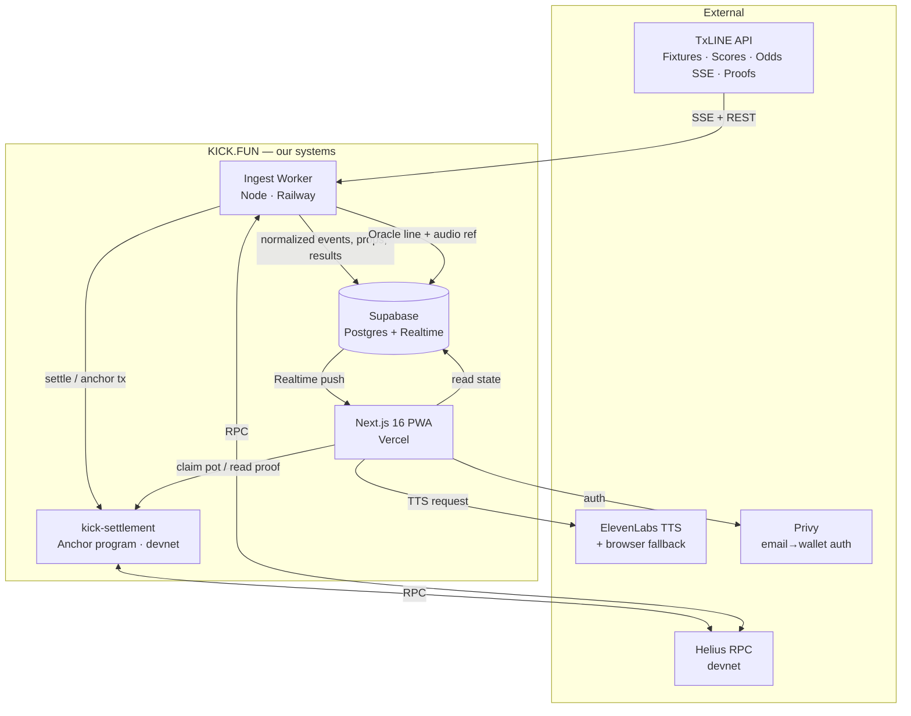
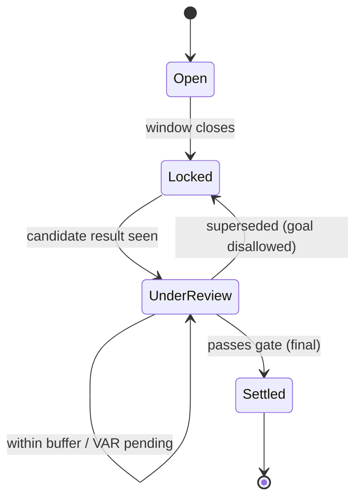
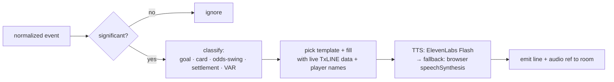

# KICK.FUN — Architecture

_How the pieces fit. One engine ingests TxLINE, everything else is a skin over it._

Companion docs: `TECH-STACK.md` (versions), `SMART-CONTRACT.md` (the program), `INTEGRATIONS.md` (external APIs + auth), `ERD.md` (data model). Product context: `PRD.md`.

---

## 1. Design goals (in priority order)

1. **Demo-proof.** Every live dependency (TxLINE stream, TTS, RPC) has a deterministic fallback so the 5-minute video can never be blocked.
2. **One source of truth for match logic.** Prop generation, result detection, and the finality gate live in one shared package — web and worker can never disagree on who won.
3. **Provable settlement, cheaply.** Exactly one real proof-verified on-chain settlement path, reused everywhere; the rest of the app is fast off-chain state.
4. **Solo-operable.** Managed infra only. No custom sockets, no self-hosted RPC, no k8s.

---

## 2. System context



**Trust boundary:** users never talk to TxLINE and never pay gas. A single **service keypair** holds the TxLINE subscription and submits settlement/anchor transactions. Users only sign a lightweight message at login (Privy) and, optionally, a `claim` transaction to receive a sponsor pot.

---

## 3. Components

### 3.1 Ingest Worker (`apps/ingest`) — the engine
Long-lived Node process (Railway/Fly; **not** a serverless function — SSE needs a persistent connection).

Responsibilities:
- **Auth + connect:** guest JWT → activate API token → open TxLINE **Scores** and **Odds** SSE streams for active matches (`INTEGRATIONS.md`).
- **Normalize:** map raw payloads → typed domain events via zod schemas in `packages/shared`.
- **Detect events:** if the stream is snapshot-based, diff consecutive snapshots to derive discrete events (goal, card, corner, odds move).
- **Prop engine:** open/lock prediction cards based on match state + odds (§4).
- **Result detector:** map incoming events to open predictions.
- **Finality gate:** hold results until final to survive VAR reversals (§5).
- **Oracle trigger:** classify significant events → pick a template → resolve TTS (§6).
- **Settlement dispatcher:** on final results, award points (DB) and, for the demo room, submit the on-chain proof-verified settlement + results-hash anchor; enable sponsor-pot claim.
- **Write:** all state to Supabase; Realtime fans it out to clients.

One upstream SSE connection **per active match**, fanned out to many room clients through Supabase Realtime (not N connections to TxLINE).

### 3.2 Web PWA (`apps/web`)
Next.js 16 App Router, mobile-first, installable. Reads live state from Supabase Realtime; renders the terrace room, leaderboard, prediction cards, proof detail, shareable card. Plays Oracle audio. Handles Privy login and the optional pot `claim` via the Codama-generated program client. Contains **no match logic** — it only renders state produced by the worker (shared types keep them honest).

### 3.3 Settlement program (`programs/kick-settlement`)
Anchor 1.0 program on devnet. Verifies a TxLINE proof (per the fallback ladder), records a room's settled-results hash, and releases a sponsor pot to the winner via a one-directional claim. Full spec in `SMART-CONTRACT.md`.

### 3.4 Shared packages
- `packages/shared` — zod schemas + all match logic (prop rules, event diffing, finality, scoring). Pure, unit-tested, no I/O.
- `packages/txline-client` — typed TxLINE REST + SSE client.
- `packages/program-client` — Codama-generated `@solana/kit` client for the program.
- `packages/oracle` — provider-agnostic TTS + template engine.
- `packages/ui` — shadcn components + brand tokens + motion primitives.

---

## 4. The prop engine (how prediction cards are born)

A **prop** is a short-horizon prediction with a clear, data-derivable resolution. Rules live in `packages/shared` so they're testable offline.

| Prop type | Opens when | Locks at | Resolves from |
| --- | --- | --- | --- |
| Next goal scorer | After each goal / at kickoff | Next goal event OR half end | Scores event |
| Card this half | Half start | Half end | Scores (card events) |
| Next-goal timing band (e.g. 60–75') | On demand during play | Band start | Scores (goal timestamp) |
| Half-time score | Pre-match / 1st-half | HT whistle | Scores snapshot at HT |
| Corners / shots over-under (next 10 min) | Rolling window | Window end | Scores stat deltas |

Engine loop: on each normalized snapshot → (a) resolve any locked props whose resolution event arrived, (b) lock any open props whose window closed, (c) open new props per rules, (d) emit changes to DB. Deterministic given a snapshot sequence → **replayable** (critical for the demo).

---

## 5. The finality gate (the VAR-safe differentiator)

Problem: a goal can be chalked off by VAR seconds later. Settling instantly would pay out a phantom result.

Solution — a result is **provisional** until it passes the gate, then **final**:
- **Supersede rule:** a later, distinct authoritative event for the same prop supersedes the earlier one (goal → disallowed).
- **Confirmation buffer:** require the result to persist for a fixed buffer (e.g. N seconds / next snapshot) before finalizing.
- **SL1 settlement source:** we settle off the **60-second-delayed** feed (PRD §5), so most VAR reversals have already resolved in the data by the time we see it. What looks like a limitation is the safety margin.

UI surfaces this as the amber **"under review"** card state — the genuinely-new fan interaction. On-chain settlement only ever fires on **final** results.



---

## 6. The Oracle trigger engine

Turns match events into spoken lines. Provider-agnostic so TTS can never block the demo.



MVP = deterministic templates (judges trust deterministic; ships fast). "Big odds swing" threshold is a tuned delta on the Odds stream. Persona (voice) is a cosmetic. LLM color commentary is stretch-only.

---

## 7. Two core sequences

### 7.1 Live prediction loop (the fun)

```mermaid
sequenceDiagram
    participant TX as TxLINE SSE
    participant ING as Ingest Worker
    participant DB as Supabase
    participant WEB as Fan (PWA)
    TX->>ING: score snapshot (goal detected)
    ING->>ING: diff → GoalEvent; run prop + finality logic
    ING->>DB: update predictions, points, leaderboard
    ING->>DB: Oracle line ("GOOOAL! [name] nailed it +50")
    DB-->>WEB: Realtime push (cards, leaderboard, audio ref)
    WEB->>WEB: animate card→settled, leaderboard reorder
    WEB->>WEB: play Oracle voice
```

### 7.2 Provable settlement + sponsor-pot claim (the proof)

```mermaid
sequenceDiagram
    participant ING as Ingest Worker
    participant TX as TxLINE Proofs
    participant PROG as kick-settlement (devnet)
    participant WEB as Winner (PWA)
    ING->>TX: GET validation proof (final result)
    TX-->>ING: signed proof (Merkle/ed25519)
    ING->>PROG: settle_room(proof, results_hash)
    PROG->>PROG: verify proof (or anchor hash — fallback ladder)
    PROG->>PROG: record results_hash; mark winner; open claim
    PROG-->>ING: tx signature (the receipt)
    ING->>DB: store proof ref + tx sig on settled predictions
    WEB->>PROG: claim_pot() (winner signs)
    PROG->>PROG: assert winner + settled; transfer devnet USDC
    PROG-->>WEB: pot received ✅
```

---

## 8. Deployment topology

| Deployable | Host | Notes |
| --- | --- | --- |
| `apps/web` | **Vercel** | Next 16, preview deploys per PR; the judge-facing URL |
| `apps/ingest` | **Railway** (or Fly.io) | Always-on; holds SSE + service keypair; autoreconnect |
| `programs/kick-settlement` | **Solana devnet** | Deployed via Anchor; program id pinned in env + client |
| DB + Realtime | **Supabase** | Managed Postgres 16; RLS on; Realtime channels per room |
| RPC | **Helius** devnet | Tx submit + optional webhook for anchor-confirm |

Data residence: live state in Supabase; proofs + result hashes anchored on devnet; TTS audio streamed to the client (not stored). Env/secrets per `TECH-STACK.md §4`.

---

## 9. Failure modes & demo safety

| Failure | Mitigation |
| --- | --- |
| TxLINE stream drops mid-demo | Worker auto-reconnects; **replay mode** plays a pre-captured match feed from our own store so the demo is deterministic. |
| No live match during judging | Entire demo runs on **replay** of a real group-stage match (PRD §11). |
| TTS API rate-limit / outage | Oracle falls back to browser `speechSynthesis` (offline, free). |
| Proof format harder than expected | Fallback ladder rung 3: anchor proof **hash** on-chain, verify signature off-chain (SMART-CONTRACT §5). |
| RPC flakiness on claim | Retry with backoff; claim is idempotent (winner + settled asserts). |
| Realtime lag | Client also polls a lightweight snapshot endpoint as a floor. |
| Privy Solana signing quirk | Fallback to Solana wallet-adapter (power-user path) — isolated to auth module. |

---

## 10. What we are explicitly NOT building (architectural non-goals)

- No matching engine / order book (we're not a market — PRD §4).
- No peer-to-peer escrow (only one-directional sponsor→winner claim).
- No custom real-time server (Supabase Realtime).
- No mainnet, no real-money custody (devnet + non-cashable points).
- No multi-sport ingest (World Cup only; the normalized TxLINE schema makes it free later — parking lot, PRD §14).

---

_The worker is the product's spine; the PWA is its face; the program is its notary. Keep match logic in one shared place and the whole thing stays honest._
