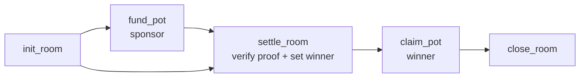

# KICK.FUN — Smart Contract Spec (`kick-settlement`)

_The on-chain notary + sponsor-pot escrow. Anchor 1.0.2, Solana devnet. Small on purpose: it proves results and pays winners — nothing else._

Companion docs: `ARCHITECTURE.md`, `INTEGRATIONS.md` (TxLINE proof format), `TECH-STACK.md`, `ERD.md`.

---

## 1. Scope: what is and isn't on-chain

| On-chain (this program) | Off-chain (Supabase / worker) |
| --- | --- |
| Verified TxLINE match result (the proof) | Prediction cards, live state |
| Hash of a room's final settled results (the receipt) | Points, streaks, leaderboard math |
| Sponsor pot custody + winner claim (devnet USDC) | Cosmetics, chat, Oracle |
| Winner attestation for a settled room | Player identities (Privy) |

**Design intent:** put on-chain only what needs to be _trustless and provable_ — the match outcome and the money. Everything cheap and fast (points, UI) stays off-chain. This keeps the program tiny, auditable, and shippable by a solo dev in the Days 6–9 block.

**Non-goals:** no order book, no peer-to-peer wagering, no points token, no mainnet, no bi-directional escrow. See `ARCHITECTURE.md §10`.

---

## 2. Program identity

- **Devnet program id:** minted at first deploy (pin in `.env` + `packages/program-client`).
- **Framework:** Anchor 1.0.2 (`avm use 1.0.2`).
- **Client:** IDL → **Codama** → typed `@solana/kit` client (`TECH-STACK §2.1`).
- **Assets:** sponsor pot = **devnet USDC** (SPL). Note TxLINE's own token uses `TOKEN_2022_PROGRAM_ID`, but we never move it — we only read TxLINE data off-chain. Our pot uses standard SPL USDC on devnet.

---

## 3. Account model (PDAs)

```
Config            (singleton)   seeds: ["config"]
 ├─ authority: Pubkey           # service/admin key (can register attestors, pause)
 ├─ txline_attestor: Pubkey     # pubkey whose signature authenticates TxLINE proofs (if ed25519 rung)
 └─ bump

Room                            seeds: ["room", room_id]
 ├─ room_id: [u8;16]            # uuid mirror of Supabase room
 ├─ fixture_id: u64             # TxLINE fixture
 ├─ authority: Pubkey           # room settler (service key)
 ├─ status: enum {Open, Settled}
 ├─ results_hash: [u8;32]       # hash of final settled results (anchored receipt)
 ├─ winner: Option<Pubkey>      # set at settlement
 ├─ pot_mint: Pubkey            # devnet USDC mint
 ├─ pot_amount: u64             # funded amount (0 if unsponsored)
 ├─ pot_claimed: bool
 ├─ settled_at: i64
 └─ bump

PotVault          (per Room)    seeds: ["vault", room_id]
 └─ SPL token account owned by the Room PDA (holds devnet USDC)
```

- **PDA ownership:** the `PotVault` token account is owned by the `Room` PDA, so only program logic can move funds.
- **`room_id`** mirrors the off-chain uuid so web/worker/program refer to the same room (see `ERD.md`).

---

## 4. Instruction set

### 4.1 `init_config` (once)
Sets `authority` and `txline_attestor`. Admin-only.

### 4.2 `init_room(room_id, fixture_id, pot_mint)`
- Signer: `authority` (service key).
- Creates `Room` (status `Open`) + `PotVault` token account (PDA-owned).
- No funds yet. Unsponsored rooms simply never get funded.

### 4.3 `fund_pot(amount)`
- Signer: **sponsor** (any funder — brand key, demo sponsor).
- Transfers `amount` devnet USDC from sponsor's ATA → `PotVault`.
- Increments `Room.pot_amount`. Callable while `Open`.
- _This is the only deposit path, and it is one-directional: sponsor → vault → winner. Players never deposit._

### 4.4 `settle_room(proof, results_hash, winner)` — the core
- Signer: `authority` (service key).
- Preconditions: `Room.status == Open`.
- Steps:
  1. **Verify the TxLINE proof** for the fixture's final result (see §5, fallback ladder).
  2. Store `results_hash` (hash of the room's final settled predictions/leaderboard snapshot).
  3. Set `winner`, `settled_at`, `status = Settled`.
  4. Emit `RoomSettled` event (fixture_id, results_hash, winner, proof ref).
- Idempotent: re-calling on a `Settled` room fails.

### 4.5 `claim_pot()`
- Signer: **winner**.
- Preconditions: `status == Settled`, `signer == winner`, `!pot_claimed`, `pot_amount > 0`.
- Transfers `pot_amount` from `PotVault` → winner's ATA. Sets `pot_claimed = true`.
- Reentrancy-safe: flag flip + single transfer under Anchor's borrow rules.

### 4.6 `close_room()` (housekeeping, optional)
- Authority reclaims rent after claim/expiry. Not demo-critical.



---

## 5. Proof verification — the rung system (UPDATED July 4 2026 after reading official TxLINE docs + tx-on-chain repo; Q1 RESOLVED)

**Verified facts** (from `txline.txodds.com/documentation/examples/onchain-validation`, `documentation/programs/devnet`, `github.com/txodds/tx-on-chain`):
- TxLINE (txoracle) **posts Merkle roots on-chain**: scores every 5 min (`epoch_day` + hour/minute-aligned PDAs; `epochDay = floor(unixMs / 86400000)`), fixtures daily, resolution roots per interval.
- Proof node format: `{ hash: [u8;32], is_right_sibling: bool }`. REST payload: `summary {fixtureId, updateStats, eventStatsSubTreeRoot}` + `subTreeProof[]` + `mainTreeProof[]` + per-stat `{statToProve, eventStatRoot, statProof[]}`.
- **`validate_stat` EXISTS on devnet.** Our v1.2 assumption that it did not was wrong (lesson logged in CLAUDE.md). It checks a stat predicate `{threshold, comparison}` against on-chain roots; their docs run it via `.view()` at ~1.4M CU.
- **Hash algorithm undocumented** — confirm against a captured real proof before enabling in-program Merkle mode.
- Ed25519-attestor design (old Rung 2) is obsolete: the system is Merkle-based end to end.

**Implemented in code: `Config.verify_mode`, rotatable via `set_verify_mode` (no redeploy).**

| Mode | What gates settlement | Status |
| --- | --- | --- |
| `HashAnchor` (rung C) | Ingest verifies off-chain; sha256 digest of the raw proof anchored in `Room.proof_digest`. Tamper-evident receipt. | **Active default, shipped.** |
| `MerkleKeccak` / `MerkleSha256` (rung B) | In-program path walk (`merkle.rs`, both algos, unit-tested, 64-node cap); `expected_root` echoed in `RoomSettled` so anyone can compare with txoracle's on-chain root for the window. Flip to the confirmed algo after testing a real proof. | **Shipped behind enum.** |
| `CpiValidateStat` (rung A) | CPI into txoracle `validate_stat` (the integration the judges' brief explicitly praises). Blocker: ~1.4M CU near the tx ceiling — needs headroom testing with real txoracle accounts. | **Reserved; returns `VerifyModeNotEnabled`.** |

All modes require `proof.fixture_id == room.fixture_id` and store `proof_digest`. Ship order honored: C runs end-to-end today; B sits in the binary awaiting algo confirmation; A lands after CU testing.

---

## 6. Trust model & honest limitations (read before the judge asks)

Be precise about what is trustless vs attested — technical judges (TxODDS) will probe this, and honesty scores.

| Claim | Reality |
| --- | --- |
| "The results hash + proof digest are anchored on-chain." | **True.** Anyone can compare the off-chain leaderboard and the raw TxLINE proof against the anchored hashes. |
| "Merkle mode verifies the proof on-chain." | **Path-consistent, not yet root-authoritative** (internal audit HIGH-1, Jul 4). The program verifies leaf→root consistency in-program, and echoes `expected_root` in the event for public comparison against txoracle's published root — but does not yet read txoracle's root account itself, so a malicious *authority* could self-consistently fake it. External attackers cannot (settlement is authority-gated). Root-registry check against txoracle's on-chain root PDAs = the planned upgrade once their account layout is ingested from the IDL. |
| "The winner is trustlessly computed on-chain." | **No, by design in MVP.** The leaderboard is computed off-chain; `settle_room` names the winner. The program anchors the standings hash but does not recompute predictions on-chain. |
| Path to full trustlessness (v2) | (a) Compare `expected_root` to txoracle's on-chain root PDA; (b) commit predictions on-chain (commit-reveal) so `winner` is derivable from anchored picks + verified results. |

**Internal audit (Jul 4, adversarial agent):** external vault theft, double-claim, re-settle, mint/destination substitution, seed collision, reentrancy, close-with-funds — all attempted, none possible. Fixes shipped from the findings: `init_config` now gated on the **program upgrade authority** (front-run guard), **cancel_room + refund_pot** added so sponsor funds can never be stranded on a void match (single sponsor per room), proof path bounded in every mode. Remaining known gap = the root-authority note above, disclosed rather than hidden.

The honest, defensible line: **the data trail is anchored and auditable end-to-end; player funds are never at risk (players never deposit); the remaining trust in the service authority is explicitly disclosed and has a stated upgrade path.**

---

## 7. Security checklist

- **Signer/authority checks** on every mutating ix (Anchor `Signer`, `has_one`, `constraint`).
- **PDA-owned vault** — funds movable only by program logic.
- **Double-claim guard** — `pot_claimed` flag + `status == Settled` assert.
- **Settlement idempotency** — cannot re-settle a `Settled` room.
- **Checked arithmetic** — `checked_add/sub` on `pot_amount`; no unchecked casts.
- **Mint match** — assert `pot_mint` == vault mint == claimant ATA mint.
- **Proof binding** — the verified proof must bind to _this_ `fixture_id` and the `results_hash` being stored (prevent replaying another match's proof).
- **Attestor integrity** — `txline_attestor` set by admin only; rotate via `init_config` authority.
- **Rent + ATA creation** — handle winner ATA init on claim (or require pre-existing ATA).
- **No `close` before claim** — guard rent reclamation against stranding an unclaimed pot.
- Devnet-only; no mainnet keys in repo.

---

## 8. Events (for the UI receipt + indexing)

```rust
#[event] pub struct RoomInitialized { room_id: [u8;16], fixture_id: u64 }
#[event] pub struct PotFunded       { room_id: [u8;16], sponsor: Pubkey, amount: u64 }
#[event] pub struct RoomSettled     { room_id: [u8;16], fixture_id: u64,
                                      results_hash: [u8;32], winner: Pubkey, proof_ref: [u8;32] }
#[event] pub struct PotClaimed      { room_id: [u8;16], winner: Pubkey, amount: u64 }
```

The web "Proof detail" screen (PRD §7.7) resolves `RoomSettled` (tx signature) + the TxLINE proof reference into the tappable receipt.

---

## 9. Testing

- **Unit (Rust):** proof-verify (all rungs with fixtures), arithmetic, claim guards.
- **Program tests:** **LiteSVM** / `anchor test` on localnet — full flow: init → fund → settle(proof) → claim; negative cases (double claim, re-settle, wrong winner, mint mismatch, replayed proof).
- **Integration:** worker submits a real settle tx against **devnet** using a captured TxLINE proof; web claims.
- **Fixtures:** capture 2–3 real TxLINE proofs early (Day 2) and commit them as test vectors so program tests don't depend on the live API.

---

## 10. Build order (maps to PRD §9 Days 6–9)

1. Scaffold Anchor program + `Config`/`Room`/`PotVault` accounts.
2. `init_config`, `init_room`, `fund_pot`, `claim_pot` (no real proof yet — stub verify true).
3. LiteSVM tests for the money path (fund → settle-stub → claim).
4. Implement the **actual proof rung** (1/2/3) from the confirmed format.
5. Codama client → wire `settle_room` from the worker and `claim_pot` from web.
6. Deploy devnet; capture the tx signatures used in the demo.

---

_Small program, big claim: the outcome is proven, the pot is safe, the standings are anchored. State the trust boundary out loud and it becomes a strength, not a gap._
