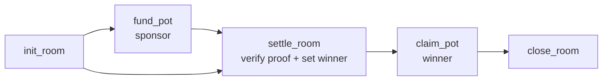

# KICK.FUN — Smart Contract Spec (`kick-settlement`)

_The on-chain notary + sponsor-pot escrow. Anchor 1.0.2, Solana devnet. Small on purpose: it proves results and pays winners — nothing else._

Companion docs: `ARCHITECTURE.md`, `INTEGRATIONS.md` (TxLINE proof format), `TECH-STACK.md`, `ERD.md`.

---

## 1. Scope: what is and isn't on-chain

| On-chain (this program) | Off-chain (Supabase / worker) |
| --- | --- |
| Verified TxLINE match result (the proof) | Prediction cards, live state |
| Hash of a room's final settled results (the receipt) | Points, streaks, leaderboard math |
| Sponsor pot custody + winner claim (devnet USDC) | Cosmetics, chat, Oracle |
| Winner attestation for a settled room | Player identities (Privy) |

**Design intent:** put on-chain only what needs to be _trustless and provable_ — the match outcome and the money. Everything cheap and fast (points, UI) stays off-chain. This keeps the program tiny, auditable, and shippable by a solo dev in the Days 6–9 block.

**Non-goals:** no order book, no peer-to-peer wagering, no points token, no mainnet, no bi-directional escrow. See `ARCHITECTURE.md §10`.

---

## 2. Program identity

- **Devnet program id:** minted at first deploy (pin in `.env` + `packages/program-client`).
- **Framework:** Anchor 1.0.2 (`avm use 1.0.2`).
- **Client:** IDL → **Codama** → typed `@solana/kit` client (`TECH-STACK §2.1`).
- **Assets:** sponsor pot = **devnet USDC** (SPL). Note TxLINE's own token uses `TOKEN_2022_PROGRAM_ID`, but we never move it — we only read TxLINE data off-chain. Our pot uses standard SPL USDC on devnet.

---

## 3. Account model (PDAs)

```
Config            (singleton)   seeds: ["config"]
 ├─ authority: Pubkey           # service/admin key (can register attestors, pause)
 ├─ txline_attestor: Pubkey     # pubkey whose signature authenticates TxLINE proofs (if ed25519 rung)
 └─ bump

Room                            seeds: ["room", room_id]
 ├─ room_id: [u8;16]            # uuid mirror of Supabase room
 ├─ fixture_id: u64             # TxLINE fixture
 ├─ authority: Pubkey           # room settler (service key)
 ├─ status: enum {Open, Settled}
 ├─ results_hash: [u8;32]       # hash of final settled results (anchored receipt)
 ├─ winner: Option<Pubkey>      # set at settlement
 ├─ pot_mint: Pubkey            # devnet USDC mint
 ├─ pot_amount: u64             # funded amount (0 if unsponsored)
 ├─ pot_claimed: bool
 ├─ settled_at: i64
 └─ bump

PotVault          (per Room)    seeds: ["vault", room_id]
 └─ SPL token account owned by the Room PDA (holds devnet USDC)
```

- **PDA ownership:** the `PotVault` token account is owned by the `Room` PDA, so only program logic can move funds.
- **`room_id`** mirrors the off-chain uuid so web/worker/program refer to the same room (see `ERD.md`).

---

## 4. Instruction set

### 4.1 `init_config` (once)
Sets `authority` and `txline_attestor`. Admin-only.

### 4.2 `init_room(room_id, fixture_id, pot_mint)`
- Signer: `authority` (service key).
- Creates `Room` (status `Open`) + `PotVault` token account (PDA-owned).
- No funds yet. Unsponsored rooms simply never get funded.

### 4.3 `fund_pot(amount)`
- Signer: **sponsor** (any funder — brand key, demo sponsor).
- Transfers `amount` devnet USDC from sponsor's ATA → `PotVault`.
- Increments `Room.pot_amount`. Callable while `Open`.
- _This is the only deposit path, and it is one-directional: sponsor → vault → winner. Players never deposit._

### 4.4 `settle_room(proof, results_hash, winner)` — the core
- Signer: `authority` (service key).
- Preconditions: `Room.status == Open`.
- Steps:
  1. **Verify the TxLINE proof** for the fixture's final result (see §5, fallback ladder).
  2. Store `results_hash` (hash of the room's final settled predictions/leaderboard snapshot).
  3. Set `winner`, `settled_at`, `status = Settled`.
  4. Emit `RoomSettled` event (fixture_id, results_hash, winner, proof ref).
- Idempotent: re-calling on a `Settled` room fails.

### 4.5 `claim_pot()`
- Signer: **winner**.
- Preconditions: `status == Settled`, `signer == winner`, `!pot_claimed`, `pot_amount > 0`.
- Transfers `pot_amount` from `PotVault` → winner's ATA. Sets `pot_claimed = true`.
- Reentrancy-safe: flag flip + single transfer under Anchor's borrow rules.

### 4.6 `close_room()` (housekeeping, optional)
- Authority reclaims rent after claim/expiry. Not demo-critical.



---

## 5. Proof verification — the fallback ladder (decide Day 2)

Everything hinges on TxLINE's proof format (open question Q1, `INTEGRATIONS.md`). Build the rung that matches; all three keep settlement gated on real data.

### Rung 1 — Merkle proof (preferred, fully in-program)
TxLINE returns a leaf (the result) + Merkle path to a signed root.
- In-program: recompute the root with `solana_program::keccak::hashv` (or sha256) over the path, assert it equals the expected root.
- Cheap, deterministic, no extra instruction. **Most trustless rung.**

### Rung 2 — Ed25519-signed payload (native program + introspection)
TxLINE signs the result payload with a known key (`Config.txline_attestor`).
- Solana programs can't call ed25519 verify directly, so the **client includes an `Ed25519Program` instruction** in the same transaction, and `settle_room` uses **instruction introspection** (`sysvar::instructions` / `load_instruction_at_checked`) to assert that instruction verified `(txline_attestor, payload, signature)` and that `payload` matches the fixture result being settled.
- Well-known pattern; budget +1 day for the introspection wiring.

### Rung 3 — Hash-anchor fallback (protects the demo)
If in-program verification fights the deadline:
- Verify the TxLINE signature **off-chain** in the ingest worker (trusted service).
- `settle_room` anchors the **hash of the signed proof** on-chain as a tamper-evident receipt (`results_hash` includes/commits to the proof digest).
- Still on-chain, still "provably real" to a fan (the proof reference resolves to TxLINE's signed data), just with an off-chain verification step. **Never let purism cost the demo** (PRD §6.3).

**Ship order:** implement rung 3 first (guarantees a working end-to-end path), then upgrade to rung 1 or 2 as the format allows. The client and account layout are identical across rungs — only the verify body changes.

---

## 6. Trust model & honest limitations (read before the judge asks)

Be precise about what is trustless vs attested — technical judges (TxODDS) will probe this, and honesty scores.

| Claim | Reality |
| --- | --- |
| "The match result can't be faked." | **True** at rung 1/2: the outcome is cryptographically verified from TxLINE's signed data on-chain. Rung 3: verified off-chain, hash anchored. |
| "The results hash is anchored on-chain." | **True.** Anyone can compare the off-chain leaderboard to the anchored hash. |
| "The winner is trustlessly computed on-chain." | **Not fully in MVP.** The leaderboard (points from predictions) is computed **off-chain** by the service; `settle_room` names the winner. The program proves the _match outcome_ and _anchors_ the final standings hash, but does not recompute every prediction on-chain. |
| Path to full trustlessness (v2) | Post each prediction commitment on-chain (commit-reveal), or prove the leaderboard with a succinct proof, so `winner` is derivable on-chain from anchored predictions + verified results. Stated as future work. |

This is the honest, defensible line: **the data is provably real; the standings are anchored + auditable; full on-chain recomputation of the leaderboard is a deliberate v2.** For a **non-cashable points** game with a **sponsor-funded** pot, service attestation of the winner is an acceptable, clearly-disclosed trust assumption — no player funds are ever at risk.

---

## 7. Security checklist

- **Signer/authority checks** on every mutating ix (Anchor `Signer`, `has_one`, `constraint`).
- **PDA-owned vault** — funds movable only by program logic.
- **Double-claim guard** — `pot_claimed` flag + `status == Settled` assert.
- **Settlement idempotency** — cannot re-settle a `Settled` room.
- **Checked arithmetic** — `checked_add/sub` on `pot_amount`; no unchecked casts.
- **Mint match** — assert `pot_mint` == vault mint == claimant ATA mint.
- **Proof binding** — the verified proof must bind to _this_ `fixture_id` and the `results_hash` being stored (prevent replaying another match's proof).
- **Attestor integrity** — `txline_attestor` set by admin only; rotate via `init_config` authority.
- **Rent + ATA creation** — handle winner ATA init on claim (or require pre-existing ATA).
- **No `close` before claim** — guard rent reclamation against stranding an unclaimed pot.
- Devnet-only; no mainnet keys in repo.

---

## 8. Events (for the UI receipt + indexing)

```rust
#[event] pub struct RoomInitialized { room_id: [u8;16], fixture_id: u64 }
#[event] pub struct PotFunded       { room_id: [u8;16], sponsor: Pubkey, amount: u64 }
#[event] pub struct RoomSettled     { room_id: [u8;16], fixture_id: u64,
                                      results_hash: [u8;32], winner: Pubkey, proof_ref: [u8;32] }
#[event] pub struct PotClaimed      { room_id: [u8;16], winner: Pubkey, amount: u64 }
```

The web "Proof detail" screen (PRD §7.7) resolves `RoomSettled` (tx signature) + the TxLINE proof reference into the tappable receipt.

---

## 9. Testing

- **Unit (Rust):** proof-verify (all rungs with fixtures), arithmetic, claim guards.
- **Program tests:** **LiteSVM** / `anchor test` on localnet — full flow: init → fund → settle(proof) → claim; negative cases (double claim, re-settle, wrong winner, mint mismatch, replayed proof).
- **Integration:** worker submits a real settle tx against **devnet** using a captured TxLINE proof; web claims.
- **Fixtures:** capture 2–3 real TxLINE proofs early (Day 2) and commit them as test vectors so program tests don't depend on the live API.

---

## 10. Build order (maps to PRD §9 Days 6–9)

1. Scaffold Anchor program + `Config`/`Room`/`PotVault` accounts.
2. `init_config`, `init_room`, `fund_pot`, `claim_pot` (no real proof yet — stub verify true).
3. LiteSVM tests for the money path (fund → settle-stub → claim).
4. Implement the **actual proof rung** (1/2/3) from the confirmed format.
5. Codama client → wire `settle_room` from the worker and `claim_pot` from web.
6. Deploy devnet; capture the tx signatures used in the demo.

---

_Small program, big claim: the outcome is proven, the pot is safe, the standings are anchored. State the trust boundary out loud and it becomes a strength, not a gap._
